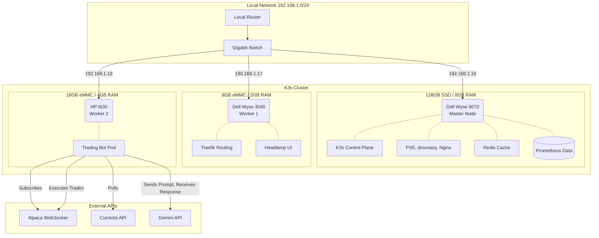

# Cluster Architecture & Design

This document details the physical, network, and software layers of the cluster.

## Hardware & Topology
Since this cluster pairs low-power thin clients with higher performance ones, workload is split amongs them based on their respective capacities.

* **Master Node (Dell Wyse 5070):** Acts as the K3s server and local infrastructure host (dnsmasq, Nginx, Prometheus). Also hosts the PXE server during setup.
* **Worker Node 1 (Dell Wyse 3040):** Limited to 2GB RAM and 8GB eMMC storage. Dedicated to lightweight Traefik routing and the Headlamp UI dashboard.
* **Worker Node 2 (HP t630):** Limited to 4GB RAM and a 16GB eMMC storage. Wholly dedicated to running the trading bot script by default.

<i>Diagram not loading? Click here for the static image</i>

## Network Port Allocation
The following tables define all static network ports allocated across host infrastructure, K3s internal services, and application workloads.

### 1. Host & Infrastructure Services
These ports run directly on the host OS (`192.168.1.16`) to support node provisioning and external cluster access:

| Port | Protocol | Service / Component | Purpose |
| :--- | :--- | :--- | :--- |
| **22** | TCP | OpenSSH | Master/Worker node access via Tailscale SSH |
| **67 / 68** | UDP | `dnsmasq` (DHCP) | Proxy DHCP server for PXE booting |
| **69** | UDP | TFTP Server | Delivers initial PXE bootloader (GRUB) to new nodes before Ubuntu installation|
| **8888** | TCP | Nginx Host | Serves Ubuntu ISO image and `cloud-init` script to new nodes |
| **38413** | TCP | K3s API Server | `kubectl` & cluster management |

Note: `dnsmasq` DNS (port 53) is disabled (`port=0`) to avoid conflicting with CoreDNS, which handles all internal cluster DNS resolution.

### 2. K3s Ingress & Workloads
These ports are managed on the worker nodes (`192.168.1.17` & `192.168.1.18`):

| Port | Protocol | Service / Component | Purpose |
| :--- | :--- | :--- | :--- |
| **80** | TCP | Traefik Ingress (HTTP) | HTTP entry point for cluster traffic |
| **443** | TCP | Traefik Ingress (HTTPS) | HTTPS entry point for cluster traffic |
| **30080** | TCP | Headlamp UI (NodePort) | Web-based Headlamp monitoring dashboard, externally accessible |
| **30081** | TCP | Grafana UI (NodePort) | Web-based Grafana monitoring dashboard, externally accessible |
| **6379** | TCP | Redis Cache (ClusterIP) | Internal cache for trading bot — not externally exposed |
| **9090** | TCP | Prometheus (ClusterIP) | Internal performance data collection — not externally exposed |

### 3. Outbound API Connections
The trading bot pod establishes outgoing connections to external APIs over the standard encrypted port 443:

| Port | Protocol | Remote Endpoint | Purpose |
| :--- | :--- | :--- | :--- |
| **443** | TCP / WSS | `stream.data.alpaca.markets` | Real-time market data Websocket stream |
| **443** | TCP | `api.alpaca.markets` | Trade execution REST API |
| **443** | TCP | `api.currentsapi.services` | News headlines REST API |
| **443** | TCP | `generativelanguage.googleapis.com` | Gemini API for trade decisions |
| **443** | TCP | `api.telegram.org` | Push notifications for daily summaries, trade alerts, cluster notifications |

## Headless OS installation
New nodes are provisioned completely automatically via a PXE server/Cloud-init method:
1. **POST & DHCP:** Node powers on, UEFI program broadcasts on `192.168.1.0/24`, looking for a PXE boot file (since PXE boot is enabled).
2. **Proxy-DHCP:** Master node (`dnsmasq`) offers the PXE boot file and points to the TFTP (file) server.
3. **HTTP Fetch:** GRUB loads the Ubuntu kernel over HTTP, taken from the master node's nginx.
4. **Cloud-init:** The `user-data` file executes disk partitioning, sets Netplan static IP, injects SSH credentials and reboots the now fully installed OS.

## 3. High Availability & Failover Mechanics
To ensure the automated trading bot does not drop its Alpaca WebSocket connection during market hours:
* **Pod Eviction:** The K3s controller monitors worker node health. If a node suffers a failure, its workloads are evicted and rescheduled onto another node.
* **State Resilience:** No trading state is kept in the pod's local memory; all order histories are stored in external JSON files on the master node's storage.

## 4. External Integrations
* **Alpaca API:** Real-time market data WebSocket and trade execution.
* **Currents API:** REST polling for financial news sentiment analysis on tech equities. Mainly used to generate pre- and post-market summaries.
* **Gemini API:** Controls logic and final decision-making on trades. Ingests live data and strict parameters from the python script.
* **Telegram Bot:** Sends pre- and post-market briefings, as well as daily summaries and trade execution alerts to user via push-notification.
