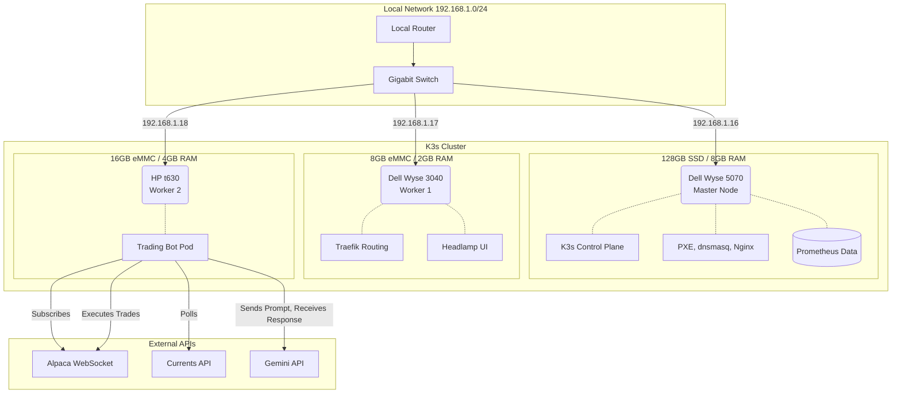

# Cluster Architecture & Design

This document details the physical, network, and software layers of the cluster.

## Hardware & Topology
Since this cluster pairs low-power thin clients with higher performance ones, workload is split amongs them based on their respective capacities.

* **Master Node (Dell Wyse 5070):** Acts as the K3s server and local infrastructure host (dnsmasq, Nginx, Prometheus). Also hosts the PXE server during setup.
* **Worker Node 1 (Dell Wyse 3040):** Limited to 2GB RAM and 8GB eMMC storage. Dedicated to lightweight Traefik routing and the Headlamp UI dashboard.
* **Worker Node 2 (HP t630):** Limited to 4GB RAM and a 16GB eMMC storage. Wholly dedicated to running the trading bot script by default.

## Network Port Allocation
abc
## Headless OS installation
New nodes are provisioned completely automatically via a PXE server/Cloud-init method:
1. **POST & DHCP:** Node powers on, UEFI program broadcasts on `192.168.1.0/24`, looking for a PXE boot file (since PXE boot is enabled).
2. **Proxy-DHCP:** Master node (`dnsmasq`) offers the PXE boot file and points to the TFTP (file) server.
3. **HTTP Fetch:** GRUB loads the Ubuntu kernel over HTTP, taken from the master node's nginx.
4. **Cloud-init:** The `user-data` file executes disk partitioning, sets Netplan static IP, injects SSH credentials and reboots the now fully installed OS.

## 3. High Availability & Failover Mechanics
To ensure the automated trading bot does not drop its Alpaca WebSocket connection during market hours:
* **Pod Eviction:** The K3s controller monitors worker node health. If a node suffers a failure, its workloads are evicted and rescheduled onto another node.
* **State Resilience:** No trading state is kept in the pod's local memory; all order histories are stored in external JSON files on the master node's storage.

## 4. External Integrations
* **Alpaca API:** Real-time market data WebSocket and trade execution.
* **Currents API:** REST polling for financial news sentiment analysis on tech equities. Mainly used to generate pre- and post-market summaries.
* **Gemini API:** Controls logic and final decision-making on trades. Ingests live data and strict parameters from the python script.
* **Telegram Bot:** Sends pre- and post-market briefings, as well as daily summaries and trade execution alerts to user via push-notification.
